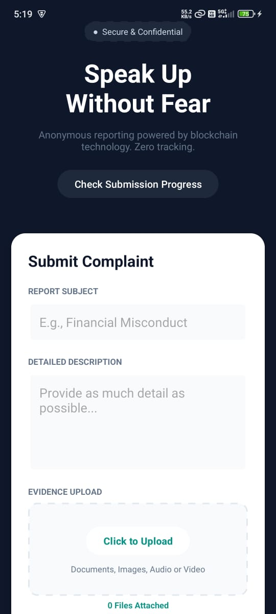
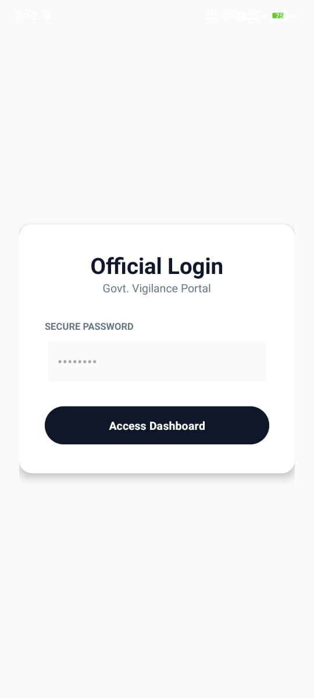
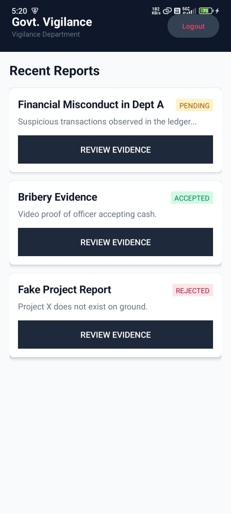
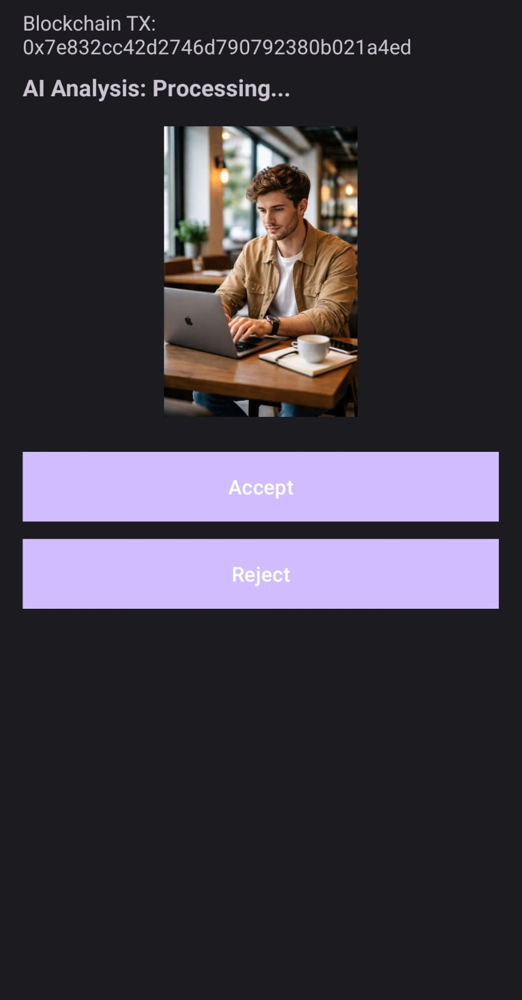
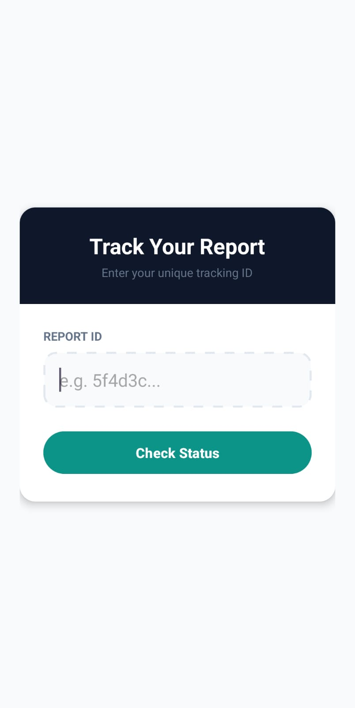

# WhistleBlower 🚨
**A Decentralized, AI-Powered Whistleblowing Platform for Transparent Governance**  

**Theme : Government + Blockchain + AI**  
## Problem Statement

Whistleblowers play a critical role in exposing corruption, fraud, and misconduct within government and public institutions. However, existing systems suffer from:

-  Lack of true anonymity  
-  Risk of evidence tampering  
-  No reliable way to verify submitted media  
-  Poor transparency in complaint handling  
-  Fear of retaliation due to identity exposure  

These limitations discourage citizens from reporting genuine issues and reduce trust in governance systems.

## Our Solution

**WhistleBlower** is a mobile-first decentralized platform that enables citizens to securely submit reports of misconduct with multimedia evidence, while ensuring:

-  No user login or identity collection  
-  Tamper-proof evidence recording using blockchain  
-  AI-based verification of submitted media  
-  Transparent and auditable review workflow  
-  Scalable architecture for government-wide adoption  

## Data Flow Diagram (DFD)


### 1. Report Submission
- User enters title & description  
- Attaches image / video / audio evidence  
- No authentication or personal data required  

### 2. Evidence Handling
- Evidence is processed locally  
- Content hash is generated  
- Hash is recorded on blockchain via smart contract  

### 3. AI Verification
- Media is securely sent to AI service (Hugging Face Space)  
- AI performs deepfake and authenticity analysis  
- Verdict is returned and stored with the report  

### 4. Admin Review
- Admin views reports in dashboard  
- Sees AI verdict + blockchain transaction reference  
- Accepts or rejects report  

### 5. Status Tracking
- Reporter tracks status using **Report ID**  
- No identity disclosure at any stage  

---

## Blockchain Design


**Smart Contract:** `WhistleblowerRegistry.sol`

### Purpose
- Ensure immutability of submitted evidence  
- Provide tamper-proof timestamping  
- Enable transparent auditing  

### Key Features
- Stores cryptographic hash of report content  
- Records submission timestamp  
- Emits events for every submission  
- Publicly verifiable on-chain  


## AI Integration
**AI Models** : [AI Model Demo](https://huggingface.co/spaces/ReaalSATYAM/DeepFakeDetector)
### AI Capabilities
- Image, video, and audio analysis  
- Deepfake detection  
- Confidence scoring  
- Multi-model verification (CNN + CLIP-based analysis)  

### Deployment
- Models deployed on **Hugging Face Spaces**  
- Accessed via secure **REST APIs**  
- Integrated directly into the admin review flow  

### Outcome
Admins receive:
- **Final verdict:** REAL / FAKE / SUSPICIOUS  
- **Confidence score**  
- **Supporting model analysis**  

This significantly reduces false reports and improves decision quality.

## API Documentation

This document outlines the APIs used by the **WhistleBlower** platform for secure report submission, AI-based evidence verification, and report status tracking. These APIs enable seamless communication between the Android client, backend services, blockchain layer, and AI infrastructure. 


## Report Submission API  
### Description  

Accepts a whistleblower report containing metadata and supporting evidence. The API records the report, generates a unique **Report ID**, and triggers blockchain recording for immutability.

> No user authentication or identity information is required.

### Request : Type multipart/form-data

### Request Parameters

| Field | Type | Required | Description |
|------|------|----------|-------------|
| title | String | Yes | Short summary of the issue |
| description | String | Yes | Detailed report description |
| department | String | Yes | Target government department |
| files | File[] | Optional | Evidence files (image, video, audio) |

### Sample Request (Conceptual)
```text
title=Financial Misconduct
description=Irregular transactions detected
department=Vigilance Department
files=[evidence1.mp4, evidence2.jpg]
```
###  Success Response
```json
{
  "success": true,
  "reportId": "WB-7F92A1",
  "message": "Report successfully recorded"
}
```

## API Scalability & Reliability

- Stateless API architecture supports horizontal scaling  
- AI inference services can be replicated across multiple nodes  
- Client-side timeout and retry mechanisms  
- Designed for future migration to government cloud infrastructure  

---

## Error Handling Strategy

| Scenario | System Behavior |
|--------|------------------|
| AI service unavailable | Admin manual review enabled |
| Backend failure | Local storage + blockchain record preserved |
| Network timeout | Safe retry without data loss |
| Invalid input | Graceful and informative error message |


## Database Schema (Logical)

> Current prototype uses local storage. Production-ready schema:

### Reports
| Field | Type |
|------|------|
| report_id | String |
| title | String |
| description | Text |
| status | Enum (pending / accepted / rejected) |
| blockchain_tx | String |
| ai_verdict | String |
| department | String |
| created_at | Timestamp |

### Evidence
| Field | Type |
|------|------|
| evidence_id | String |
| report_id | String |
| file_type | Image / Video / Audio |
| storage_uri | String |
| hash | String |

---

## Android Application Structure

```text
app/
 └── java/com.example.whistleblower
     ├── MainActivity              # Report Submission
     ├── StatusActivity            # Track Report Status
     ├── AdminLoginActivity        # Admin Authentication
     ├── AdminDashboardActivity    # Report Listing
     ├── EvidenceReviewActivity    # AI + Blockchain Review
     ├── LocalReportStore          # Offline-first Storage
     └── api/                      # Retrofit & AI APIs

blockchain/
 └── WhistleblowerRegistry.sol
```

##  Security & Privacy Design

- No user login required  
- No personal identifiers collected  
- Evidence integrity protected by blockchain  
- AI analysis performed without exposing user identity  
- Admin access restricted via protected login  

**Maximum anonymity and safety for whistleblowers is guaranteed.**

---

## Scalability & Future Growth

### Horizontal Scaling
- Backend APIs can be containerized and scaled  
- AI inference load-balanced across multiple model instances  

### Blockchain Scaling
Deployable on:
- Ethereum L2  
- Polygon  
- Government-controlled permissioned blockchain  

### Storage Scaling
Evidence files can be stored on:
- IPFS  
- Government cloud object storage  

---

## Failure Handling

| Scenario | Handling |
|--------|----------|
| AI service unavailable | Admin can manually review |
| Network failure | Offline-first local storage |
| Backend failure | Blockchain record remains intact |
| App crash | Reports preserved locally |

The system is designed to **fail gracefully without data loss**.

---

## Impact & Usefulness

WhistleBlower can be adopted by:
- Anti-corruption bureaus  
- Vigilance departments  
- NGOs  
- Public grievance cells  

It promotes:
- Transparency  
- Citizen trust  
- Accountable governance  
- Safe reporting culture  

---

## Demo
### 1. Enter the Evidence
   - **Action**: User uploads evidence (image, video, audio).
   - 

### 2. Admin Login
   - **Action**: Admin logs into the dashboard to review evidence.
   - Password: admin123
   - 

### 3. Process the Evidence Using AI Models and Accept/Reject it.
   - **Action**: Admin uses AI to analyze the evidence for authenticity and accepts or rejects the evidence after reviewing the AI results.
   - 
   - 

### 4. Check the Status
   - **Action**: User or admin checks the status of the report.
   - 
   

## Conclusion

**WhistleBlower** moves beyond ideation into real execution by combining **AI verification**, **blockchain immutability**, and **mobile accessibility** to solve a critical governance problem.
