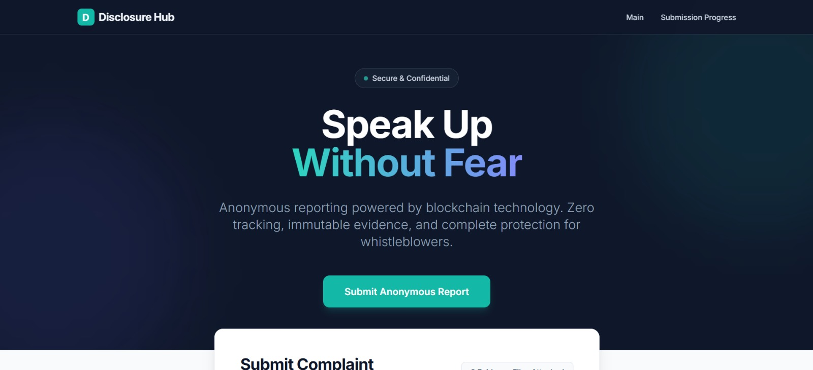
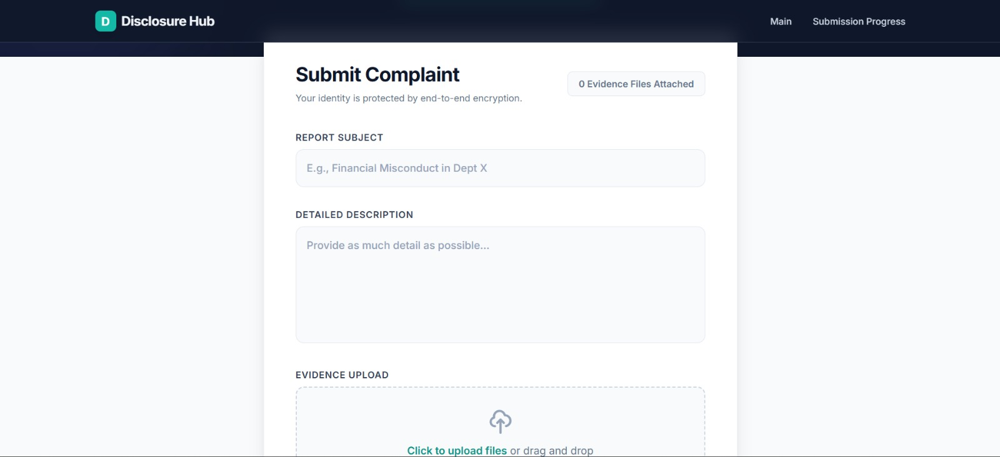
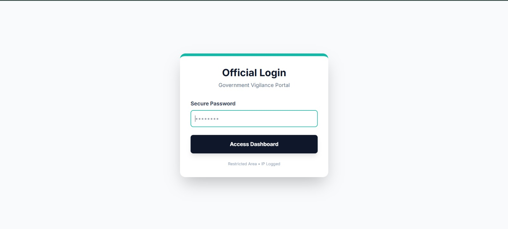
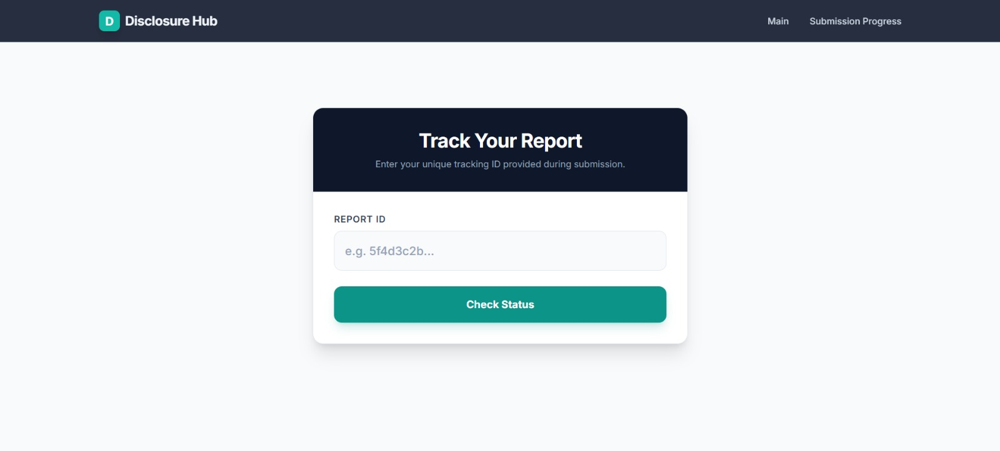

# WhistleBlower 🚨
A decentralized platform for securely submitting and reviewing complaints or reports of misconduct, combining AI, blockchain, and modern web technologies.

## Overview
**WhistleBlower** allows users to submit reports with multimedia evidence, which are then verified using AI models. All submissions are stored on a tamper-proof blockchain, ensuring transparency and integrity. Admins can review, verify, and manage reports efficiently through a dynamic dashboard.

**Theme Selected**: Government + Blockchain + AI

## Features Implemented 
### Flowchart 


### Web Interface
- **Login free** user-friendly complaint submission form supporting multiple file types (images, audio, video).
- Dynamic admin dashboard with:
  - Report overview
  - Evidence preview
  - AI verdict and confidence scores
  - Status management (Accepted / Rejected / Pending)

### Backend
- **Node.js + Express.js** server handling report submission, status updates, and retrieval.
- In-memory database for fast testing (to be replaced with a persistent DB later).
- API endpoints:
  - `POST /api/report` → Submit new reports
  - `GET /api/reports` → Fetch all reports
  - `POST /api/update-status` → Update report status
  - `GET /api/status/:id` → Check status of a report by ID
- Automated department assignment using NLP on the report description.

### AI Integration
- Image and video evidence verification.
- Detection of fake or suspicious content.
- Confidence scoring for each AI verdict.

### Blockchain Integration
- Tamper-proof recordkeeping for all reports and evidence.
- Immutable audit trail for admin actions and status changes.

### Security & Management
- File uploads stored in `/uploads` (excluded from Git via `.gitignore`).
- Admin role verification for dashboard access.
- Real-time rendering of AI results for each piece of evidence.

## Technical Flow / Architecture

### User Submits Report
- Title, description, and multimedia evidence are uploaded via the web interface without any login.

### Server Processing
- Backend stores the report in the database and uploads files to server storage.
- AI model evaluates evidence and provides verdicts.

### Blockchain Logging
- Each report submission, evidence upload, and admin action is recorded on the blockchain for immutability.

### Admin Dashboard
- Admins review reports, process evidence with AI, and update status.

### User Notification
- Users can track the report status and view AI verdicts.

## Getting Started

### Clone the repository

```bash
git clone https://github.com/ReaalSATYAM/WhistleBlower.git
cd WhistleBlower
```

### Run Backend
```bash
cd backend
node server.js
```

### Flask API
```bash
cd evidence_service
python app.py
```

### Run Frontend
```bash
cd frontend
npm run dev
```

## Live Demo

🔗 **Frontend Demo:**  
[WhistleBlower Frontend Demo](https://reaalsatyam.github.io/WhistleBlower/)  

**AI Models** : [AI Model Demo](https://huggingface.co/spaces/ReaalSATYAM/DeepFakeDetector)
The live demo showcases:
<video width="400" height="240" controls>
  <source src="(https://github.com/ReaalSATYAM/WhistleBlower/WebApp/demo.mp4" type="video/mp4">
  Your browser does not support the video tag.
</video>

- Whistleblower report submission flow
- Admin login and dashboard UI
- Application routing and overall user experience

### Demo Limitations
- GitHub Pages supports frontend-only (static) hosting.
- Backend services, AI model inference, and blockchain interactions are not active in the live demo.
- Evidence upload UI is visible, but actual AI analysis and blockchain logging run locally.
- Full implementation details are documented in folder-wise README files (backend, evidence_service, blockchain, frontend).
- All core features are fully implemented and reproducible locally.

## Step-By-Step Procedure

### 1. Enter the Evidence
   - **Action**: User uploads evidence (image, video, audio).
   - 
   - 

### 2. Admin Login
   - **Action**: Admin logs into the dashboard to review evidence.
   - Password: admin123
   - 

### 3. Process the Evidence Using AI Models and Accept/Reject it.
   - **Action**: Admin uses AI to analyze the evidence for authenticity and accepts or rejects the evidence after reviewing the AI results.
   - 

### 4. Check the Status
   - **Action**: User or admin checks the status of the report.
   - 


## Vision & Purpose

### Our Vision
To create a corruption-free, transparent, and accountable society by empowering citizens to safely report misconduct and unethical practices. WhistleBlower envisions a world where transparency is the norm, not the exception, and every voice matters.

### Why WhistleBlower is Needed
- **Empowering Citizens**:  
  Many people witness corruption, mismanagement, or misuse of resources but lack a secure platform to report it. WhistleBlower ensures anonymity and protection, encouraging citizens to speak up without fear.

- **Transparency & Accountability**:  
  Government departments and organizations can track reports with a tamper-proof blockchain, creating an immutable audit trail. This reduces manipulation and ensures trust in the reporting system.

- **Efficient Investigation**:  
  AI-assisted verification of evidence (images, videos, audio) reduces manual effort and speeds up the evaluation process. Reports are categorized intelligently, making it easier for authorities to act promptly.

- **Reducing Corruption at Scale**:  
  By making reporting easy, secure, and reliable, WhistleBlower helps uncover corruption across different sectors, contributing to a more ethical and transparent governance system.

### Integrating Modern Technology:
- **Blockchain**: Ensures data immutability and transparency.
- **AI**: Detects fake or manipulated evidence, increasing credibility.
- **Mobile & Web Access**: Anyone can report, anytime, anywhere.

## Impact
- Protects whistleblowers while ensuring evidence integrity.
- Streamlines reporting for government and organizational oversight.
- Promotes citizen participation in governance.
- Paves the way for a corruption-free India through technology-driven accountability.

## Project Documentation Structure
To ensure clarity, transparency, and ease of evaluation, this repository follows a modular documentation approach.

Each major component of the system has its own dedicated README file, explaining:
- Design decisions
- Technical flow
- Models, tools, and limitations
- Current implementation (Round 1)
- Planned improvements (Round 2)

### Available Module-wise READMEs
- `evidence_service/README.md` → AI models, deepfake detection pipeline (image/video/audio)
- `blockchain/README.md` → Smart contract design and immutability logic
- `backend/README.md` → API design, report handling, storage flow
- `frontend/README.md` → User interface, admin dashboard, UX flow
